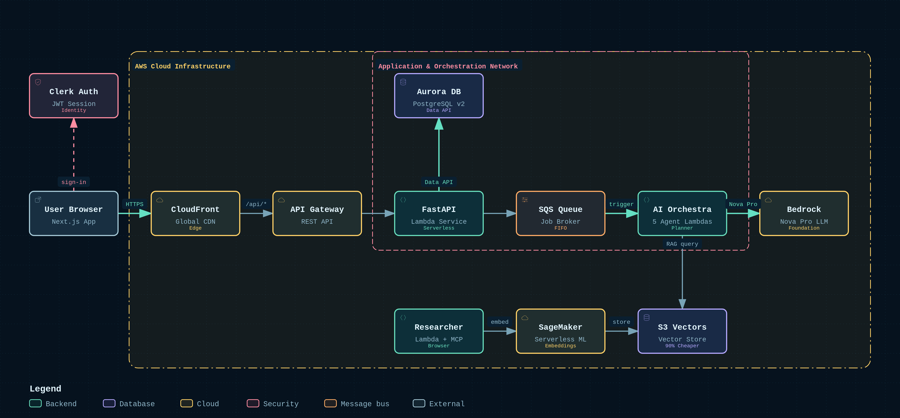

# Alex - Enterprise Multi-Agent SaaS Financial Planning Platform



Alex (Agentic Learning Equities Planner) is a production-grade multi-agent SaaS financial planning system built with AWS Serverless, Bedrock Nova Pro, S3 Vectors, and Next.js.

## Architecture Highlights
- **Multi-Agent Orchestra**: 5 specialized AI agents collaborating via SQS (Planner, Tagger, Reporter, Charter, Retirement)
- **Autonomous Researcher**: Scheduled App Runner service with Playwright MCP web browsing
- **Cost-Optimized Vector Storage**: S3 Vectors (90% cheaper than OpenSearch)
- **Zero-VPC Database**: Aurora Serverless v2 PostgreSQL managed via AWS Data API
- **Modern Monorepo**: Managed via `uv workspace` with centralized libraries and unified Docker packaging

---

## Directory Structure

```
.
├── libs/                         # Shared Libraries (uv packages)
│   ├── common/                   # Langfuse tracing, Bedrock helpers, logger
│   └── database/                 # Aurora Data API client, models, schemas, migrations
│
├── services/                     # Deployable Services & Agents
│   ├── agents/                   # Lambda Agents (Planner, Tagger, Reporter, Charter, Retirement)
│   │   ├── planner/ (src/ & tests/)
│   │   ├── tagger/
│   │   ├── reporter/
│   │   ├── charter/
│   │   └── retirement/
│   ├── api/                      # FastAPI Lambda backend
│   ├── researcher/               # Autonomous Research Service (App Runner)
│   ├── ingest/                   # Document / Vector Ingestion (Lambda)
│   └── scheduler/                # EventBridge Trigger (Lambda)
│
├── frontend/                     # Next.js React frontend (Clerk authentication)
├── infra/                        # Infrastructure as Code
│   └── modules/                  # Terraform modules (sagemaker, database, agents, frontend...)
│
├── scripts/                      # Unified Operations & Deployment
│   ├── build/                    # package_lambda.py (Docker build for Lambdas)
│   ├── deploy/                   # deploy_agents.py, deploy_frontend.py, destroy.py
│   ├── db/                       # seed_data.py, reset_db.py, check_db.py
│   ├── ops/                      # watch_agents.py
│   ├── dev/                      # run_local.py
│   └── test/                     # test_e2e.py, test_scale.py
│
└── dist/                         # [GITIGNORED] Lambda deployment zip archives
```

---

## Quick Start

### 1. Prerequisites
- Python 3.12+ and [uv](https://docs.astral.sh/uv/)
- Docker Desktop (running)
- AWS CLI configured (`aws configure`)
- Node.js 20+

### 2. Setup Environment
```bash
# Copy and configure environment variables
cp .env.example .env

# Sync workspace dependencies
uv sync
```

### 3. Package Lambda Agents
```bash
# Package all lambda functions into dist/ using Docker
uv run scripts/build/package_lambda.py --all
```

### 4. Deploy Infrastructure
```bash
# Deploy agents
uv run scripts/deploy/deploy_agents.py

# Deploy frontend
uv run scripts/deploy/deploy_frontend.py
```

### 5. Local Development
```bash
# Run local mock test
uv run scripts/test/test_simple.py

# Live agent status dashboard
uv run scripts/ops/watch_agents.py
```
